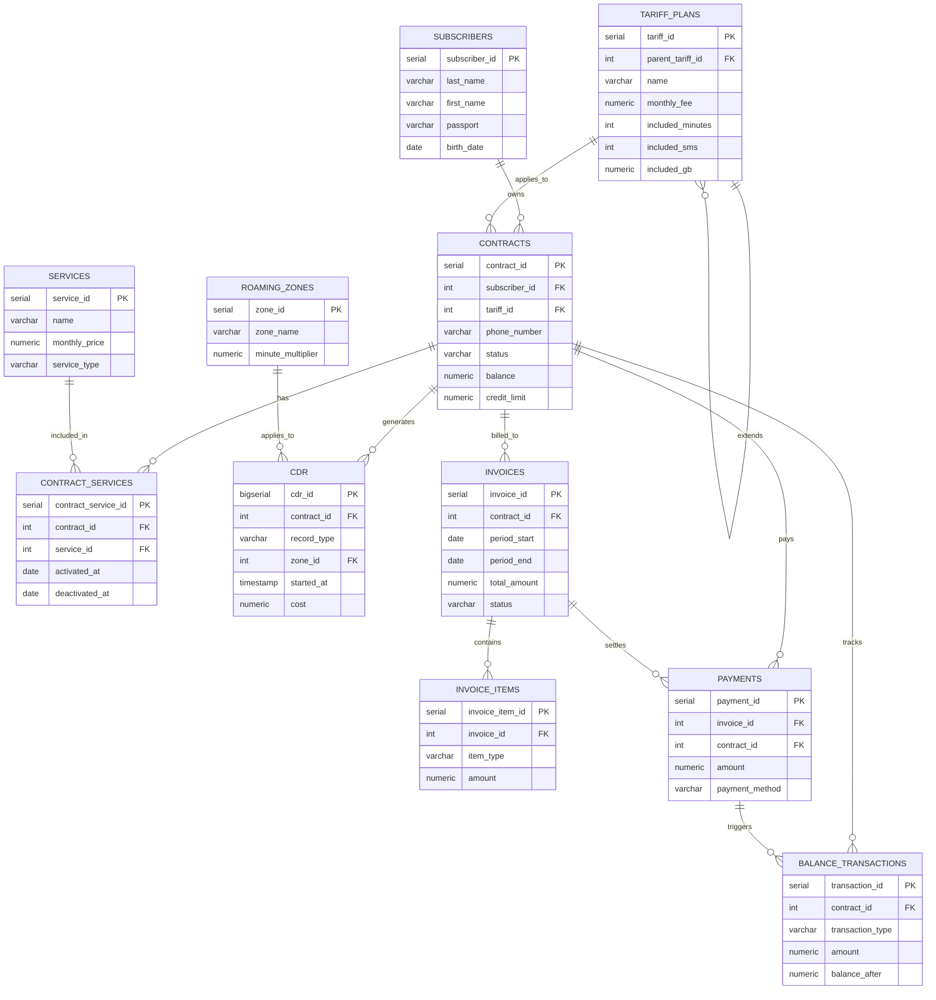

# ВЫПОЛНИЛ
Ученик: Казанцев Семён Викторович (ИСУ: 466074)
# Биллинговая система оператора мобильной связи
Учебный проект по курсу «Базы данных» (ИТМО, факультет ФТМИ, БИ).
Спроектирована и реализована модель данных для упрощённого аналога BSS-системы (Business Support System) — той категории продуктов, которую разрабатывают компании для операторов связи.

## О проекте

Биллинг оператора связи — одна из самых требовательных предметных областей для баз данных: большой поток транзакционных данных (звонки, SMS, интернет-сессии), строгие финансовые расчёты, необходимость в высокой производительности при росте объёма данных и сложная бизнес-логика (лимиты, роуминг, блокировки).

Проект охватывает полный цикл биллинга:

- регистрация абонентов и подключение тарифных планов;
- учёт детальных записей об оказанных услугах (CDR — Call Detail Records);
- тарификация с учётом пакетов услуг, роуминга и сверхлимитного потребления;
- формирование счетов и контроль оплат;
- автоматическое управление балансом и блокировкой абонентов.

## Структура базы данных

База данных состоит из 11 таблиц, организованных в три смысловых блока:

**Справочники**
- `subscribers` — абоненты
- `tariff_plans` — тарифные планы (с поддержкой иерархии наследования тарифов)
- `services` — каталог дополнительных услуг
- `roaming_zones` — зоны роуминга с множителями тарификации

**Операционный блок**
- `contracts` — договоры/номера абонентов (баланс, кредитный лимит, статус)
- `contract_services` — подключённые услуги (связь M:N)
- `cdr` — детальные записи о звонках, SMS и интернет-сессиях

**Финансовый блок**
- `invoices` — счета за период
- `invoice_items` — детализация счёта по статьям
- `payments` — платежи абонентов
- `balance_transactions` — история изменений баланса

### ER-диаграмма



## Технические решения

### Партиционирование

Таблица `cdr` партиционирована по диапазону дат (`PARTITION BY RANGE`) с разбивкой по месяцам. В реальной биллинговой системе таблица детальных записей растёт быстрее всех остальных — партиционирование позволяет ускорять запросы за конкретный период и упрощать архивацию старых данных без блокировки всей таблицы.

### Представления (VIEW)

- `v_contract_overview` — сводка по договору: баланс, тариф, статус и индикатор состояния баланса
- `v_cdr_detailed` — детализация звонков/SMS/интернета с указанием абонента и зоны
- `v_invoice_payment_status` — статус оплаты счёта с расчётом остатка задолженности

### Материализованное представление

`mv_revenue_by_tariff_month` — агрегированная выручка по тарифам и месяцам. В отличие от обычного VIEW, результат физически сохраняется и обновляется по расписанию (`REFRESH MATERIALIZED VIEW CONCURRENTLY`) — типичный паттерн для тяжёлой отчётности, которую не считают «на лету» при каждом обращении.

### Функции (PL/pgSQL)

- `calculate_call_cost()` — расчёт стоимости звонка с учётом остатка пакета минут и множителя роуминговой зоны
- `generate_invoice()` — автоматическое формирование счёта за период с детализацией по статьям
- `get_debt_ratio_by_tariff()` — доля абонентов с задолженностью в разрезе тарифа
- `get_subscriber_spending()` — суммарные расходы абонента за произвольный период

### Триггеры

- автоматическая синхронизация баланса договора при добавлении записи в `balance_transactions`
- автоблокировка договора (`status = 'suspended'`) при превышении кредитного лимита
- запрет тарификации для договоров со статусом `terminated`
- защита от повторного подключения уже активной услуги

### Оконные функции

- `RANK()` — топ абонентов по тратам за месяц
- `SUM() OVER (... ROWS BETWEEN UNBOUNDED PRECEDING AND CURRENT ROW)` — накопительная выручка
- `DENSE_RANK()` — рейтинг популярности тарифных планов
- `LAG()` — динамика расходов абонента месяц к месяцу

### Рекурсивный запрос (CTE)

Построение иерархии тарифных планов: некоторые тарифы являются «надстройкой» над базовым (например, «Безлимитище 2.0» наследуется от «Безлимитище»). `WITH RECURSIVE` строит полную цепочку наследования с указанием уровня вложенности.

## Структура репозитория

```
mobile-billing-system/
├── sql/
│   ├── 01_ddl.sql               — создание таблиц и партиционирование
│   ├── 02_data.sql              — тестовые данные
│   ├── 03_views.sql             — представления и материализованное представление
│   ├── 04_functions.sql         — функции PL/pgSQL
│   ├── 05_triggers.sql          — триггеры
│   └── 06_window_functions.sql  — оконные функции и рекурсивный CTE
└── README.md
```

## Запуск проекта

```bash
createdb billing_system

psql -d billing_system -f sql/01_ddl.sql
psql -d billing_system -f sql/05_triggers.sql
psql -d billing_system -f sql/02_data.sql
psql -d billing_system -f sql/03_views.sql
psql -d billing_system -f sql/04_functions.sql
psql -d billing_system -f sql/06_window_functions.sql
```

> Важно: триггеры создаются до загрузки данных, так как часть бизнес-логики (автообновление баланса, блокировка по кредитному лимиту) срабатывает уже на этапе вставки тестовых записей.


